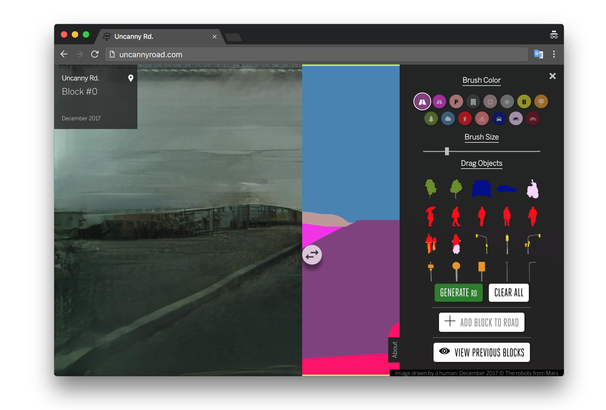

# [Uncanny Road](http://uncannyroad.com)

Uncanny Road is an experimental tool to collectively hallucinating a never-ending road using Generative Adversarial Neural Networks. It is based on the pix2pixHD project, published by Nvida and UC Berkeley ([Project](https://tcwang0509.github.io/pix2pixHD/), [Paper](https://arxiv.org/pdf/1711.11585.pdf) and [Code](https://github.com/NVIDIA/pix2pixHD)), that allows for photorealistic image-to-image translation.

Made by [Anastasis Germanidis](http://agermanidis.com) and [Cristóbal Valenzuela](http://cvalenzuelab.com/)

 # Develop

 Todo

 # Licence

 Todo

